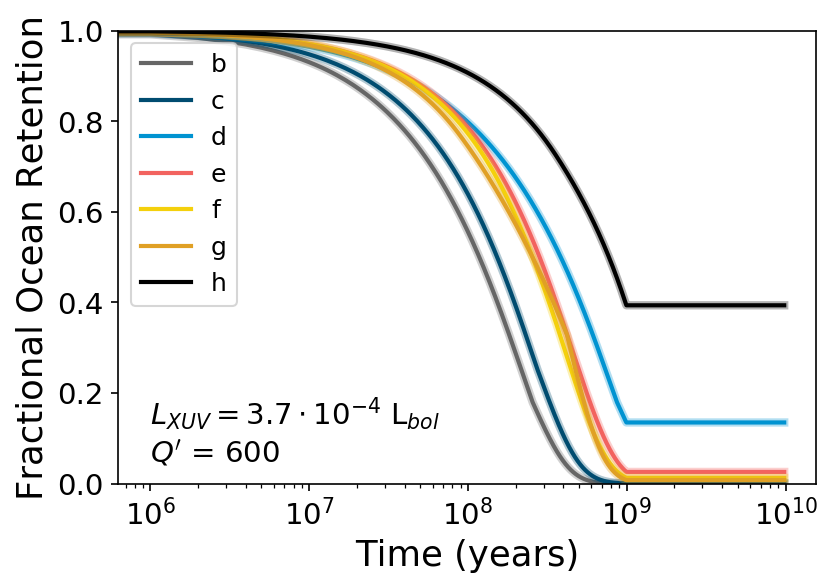

Atmospheric Escape  with an Evolving XUV Luminosity in the TRAPPIST-1 Planetary System
============

Overview
--------

We use `vplanet <https://github.com/VirtualPlanetaryLaboratory/vplanet>`_ to model water photolysis and hydrogen escape for the TRAPPIST-1 planetary system, matching the current-day XUV luminosity output from the code to our measured values from Becker et al. 2020. The result is a measure of the ocean content on each planet overtime. 


===================   ============
**Date**              5/4/20
**Author**            Juliette Becker
**Modules**           AtmEsc, EqTide, STELLAR
**Approx. runtime**   20-30 seconds
**Source code**       `vplanet <https://github.com/VirtualPlanetaryLaboratory/vplanet>`_,
                      `vplot <https://github.com/VirtualPlanetaryLaboratory/vplot>`_
===================   ============

Details on this analysis
-------------------

To run the code in this directory, make sure VPlanet is installed on your machine and run:

```
  vplanet vpl.in
```

Which creates the output files (trappist1.b.forward, etc) needed in the MakeFigures.ipynb script. There are several other folders in this repository (run01, run02, run03) which contain runs of this system with different planet parameters. 

Some of the things we modeled (and the flags you need to use in the relevant files to include them) are as follows:

1. We include the best-fit XUV decay model from [Fleming et al. 2020](https://iopscience.iop.org/article/10.3847/1538-4357/ab77ad/meta) by fixing parameters `dSatXUVFrac`, `dXUVBeta`, `dSatXUVTime`, and `sMagBrakingModel`, which are all set in the `star.in` file. These parameters allow you to change the amount of time that the star remains saturated in the XUV, and also change the slope of the decay once it leaves the saturated phase. 

2. By default, VPlanet ends water photolysis and mass loss once the planet reaches the habitable zone. To turn this off (and allow the mass loss to continue), use flag `bStopWaterLossInHZ	  0` in the planet parameter files (b.in, c.in, etc). A flag of 1 (the default) means that you turn off mass loss, and a flag of 0 means that you allow it to continue. 


Output
---------------



Water mass loss over time of planets in the TRAPPIST-1 system. See `MakeFigures.ipynb <https://github.com/jxcbecker/trappist1/blob/master/MakeFigures.ipynb>`_ for the code to make this figure (and others).